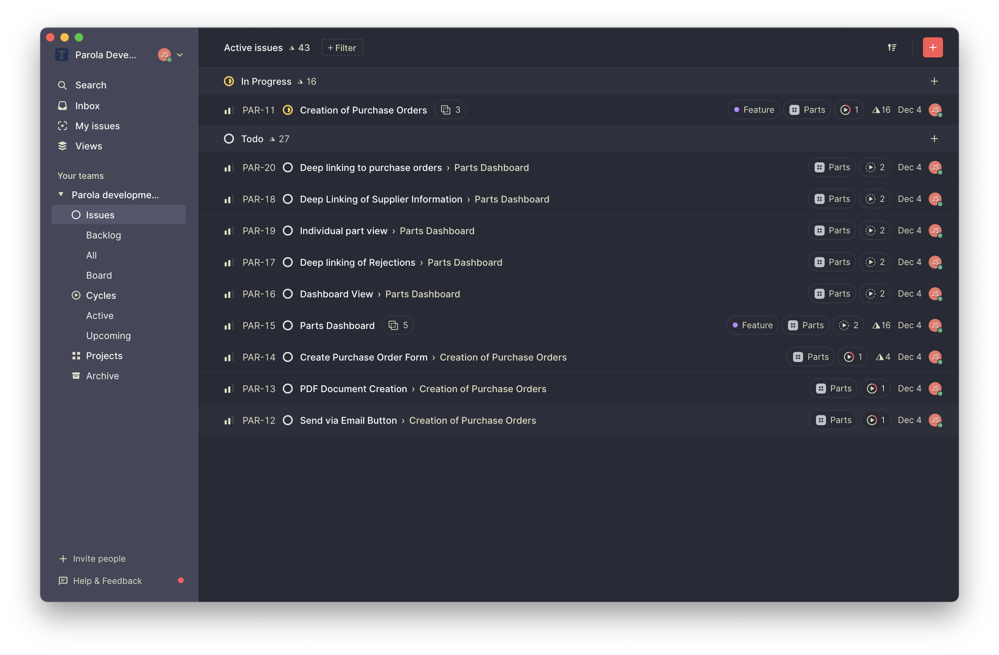

# Dracula for [X](http://link-to-x.com)

> A dark theme for [X](http://link-to-x.com).

## Install

All instructions can be found at [draculatheme.com/linear](https://draculatheme.com/linear).

## Team

This theme is maintained by the following person(s) and a bunch of [awesome contributors](https://github.com/dracula/template/graphs/contributors).

 |
--- |
[Jamie Shiers](https://github.com/jamieshiers) |  |
--- |
[Zeno Rocha](https://github.com/zenorocha) |

## License

[MIT License](./LICENSE)
